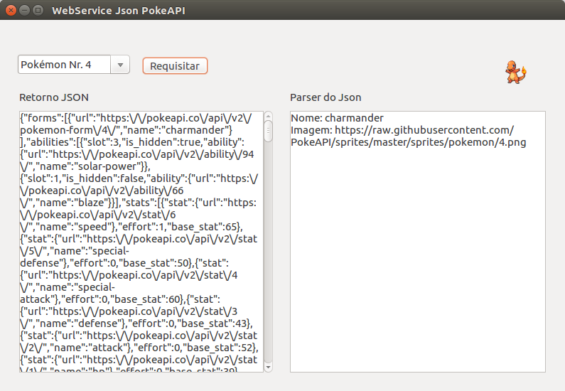

## Consumindo API JSON em Lazarus
Este projeto é um exercício educacional de programação visual em [Lazarus](https://www.lazarus-ide.org/). A ideia é consumir dados de uma API que retorne os dados em JSON. Como estudo de caso é utilizada a API [https://pokeapi.co](https://pokeapi.co) onde retorna dados de pokémons.



É necessário possuir na máquina OpenSSL instalado, inclusive pacotes para desenvolvimento. Isto é facilmente resolvido em ambiente Linux com:


```
sudo apt-get install openssl libssl-dev libssl-doc
```


Maiores detalhes constam em comentários descritas pelas unidades.


### Itens realizados

* Através de um número entre 1 e 802 realiza uma requisição ao webservice o pokémon específico (são 802 pokémons na API respectiva).
* Após retorno dos dados, é realizado o download de uma imagem do pokémon (em uma segunda requisição). A imagem é exibida em um TImage.
* Dois TMemos são utilizados para exibir o retorno JSON do response e o parse realizado da mesma. Neste caso o nome e o link da imagem são exibidos como exemplo.


### Melhorias

* Precisa de um melhor tratamento de exceções no HTTP status code response.
* Melhorar feedback ao usuário sobre intervalo de processamento entr request e response.
* Melhorar a organização de código, refatorar.


### Referências

* [Fórum Lazarus](http://forum.lazarus.freepascal.org/index.php?topic=36035.0)
* [fcl-json](http://wiki.freepascal.org/fcl-json)
* [Synapse](http://wiki.freepascal.org/Synapse#Simple_version)
